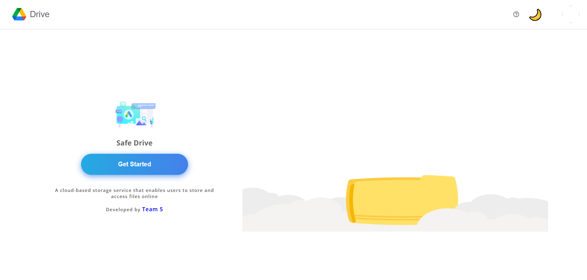

# Cloud Storage Application

              

A full-stack cloud storage application built using React, Firebase, and styled-components.

## Table of Contents

- [Demo](#demo)
- [Features](#features)
- [Tech Stack](#tech-stack)
- [Installation](#installation)
- [Usage](#usage)

## Features

- User authentication with Firebase
- Upload, download, and delete files
- Star and trash functionality
- Responsive design for a seamless user experience
- Password protected files using Qkey,SHA-256 and AES-GSM

## Tech Stack

- Frontend: React, styled-components
- Backend: Firebase (Authentication, Firestore)
- Other: react-router-dom, react-toastify

## Installation

1. Clone the repository: `git clone https://github.com/Mayankkatheriya/google-drive-clone.git`
2. Change into the project directory: `cd google-drive-clone`
3. Install dependencies: `npm install`

## Usage

1. Start the development server: `npm run dev`
2. Open the app in your browser: `http://localhost:5173`

